# Day 2: Floorplanning & Standard Cell Placement (PicoRV32A)

## Overview

Day 2 transitions the design from a logical gate-level netlist into a distinct physical blueprint. Using the **OpenLane** flow orchestration and the **Magic VLSI** layout tool, this phase establishes the physical boundaries, core utilization metrics, power delivery structures, and subsequent optimal cell placement for the **PicoRV32A RISC-V** core on the **SKY130A PDK** node.

---

## Floorplan Generation & Geometry Calculations

Following a successful synthesis run, the initial floorplan layout is initialized:

```tcl
run_floorplan

```

The OpenLane console logs the calculated dimensions upon execution:

```text
Floorplanned with width = 1267.76 µm
Floorplanned with height = 1267.52 µm

```
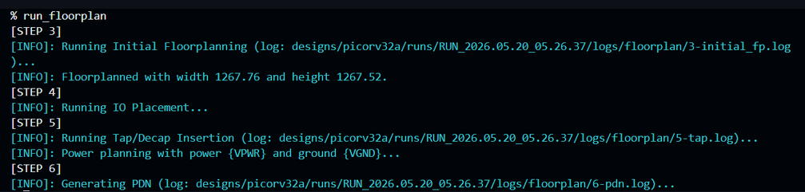


An Aspect Ratio of approximately $1.0$ yields a square floorplan. This symmetric footprint uniformly balances routing resources, limits localized horizontal or vertical routing congestion, and optimizes the structural implementation of subsequent design steps.

---

## Core Utilization Strategy & Configuration Hierarchy

To evaluate the footprint density, the root configuration file was audited:

```text
designs/picorv32a/config.tcl

```

```tcl
set ::env(FP_CORE_UTIL) "10"

```
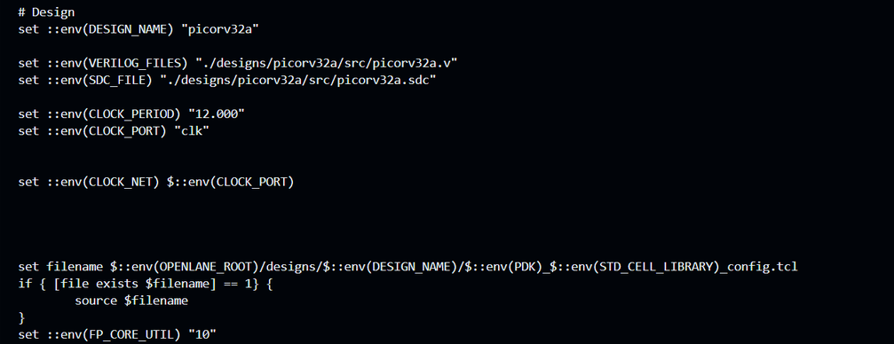

### Utilization Formula
| Parameter | Mathematical Definition |
| :--- | :--- |
| **Core Utilization** | $\text{Core Utilization } (\%) = \left( \frac{\text{Total Macro \& Standard Cell Area}}{\text{Total Available Core Area}} \right) \times 100$ |
A setting of `10` allocates exactly 10% of the interior core space to standard logic cells, reserving the remaining 90% as pristine whitespace. This low-density initialization guarantees abundant routing channels for dense interconnects, though it expands the overall physical silicon area.

### Runtime Snapshots

OpenLane does not parse variables directly from local directories mid-execution. It captures global PDK specifications, design adjustments, and system defaults to export an isolated runtime snapshot:

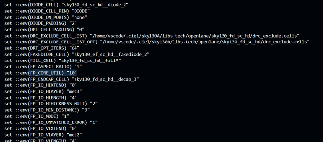

```text
runs/RUN_xxx/config.tcl

```

This structural isolation ensures that environmental configurations remain highly traceable and reproducible across iterative layout configurations.

---

## DEF Physical Mapping & Unit Conversion

To confirm the tool's absolute geometric calculations, the generated Design Exchange Format (`.def`) file was reviewed:

```text
results/floorplan/picorv32a.def

```

```text
UNITS DISTANCE MICRONS 1000 ;
DIEAREA ( 0 0 ) ( 1279175 1289895 ) ;

```
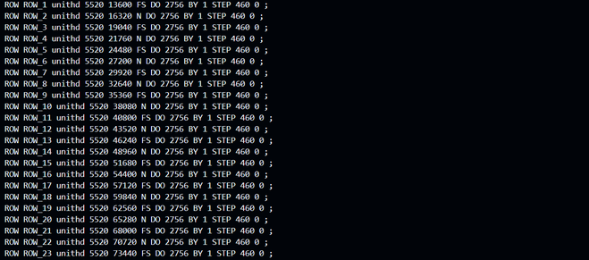

The parameters inside the `.def` manifest are represented in Database Units (DBU). For this process node, $1000 \text{ DBU} = 1\,\mu\text{m}$.

| Coordinate Parameter | Database Units (DBU) | Converted Value ($\mu\text{m}$) |
| --- | --- | --- |
| **X-Max (Width)** | $1,279,175$ | $1279.175\,\mu\text{m}$ |
| **Y-Max (Height)** | $1,289,895$ | $1289.895\,\mu\text{m}$ |

$$\text{Total Die Area} = 1279.175\,\mu\text{m} \times 1289.895\,\mu\text{m} \approx 1,650,898\,\mu\text{m}^2$$

---

## Layout Visualization & Infrastructure Auditing

The physical abstraction layer was verified visually in Magic by reading the unified Library Exchange Format (`.lef`) macros alongside the floorplanned structural `.def`:

```bash
magic -T sky130A.tech \
lef read ../../../tmp/merged.nom.lef \
def read picorv32a.def &

```
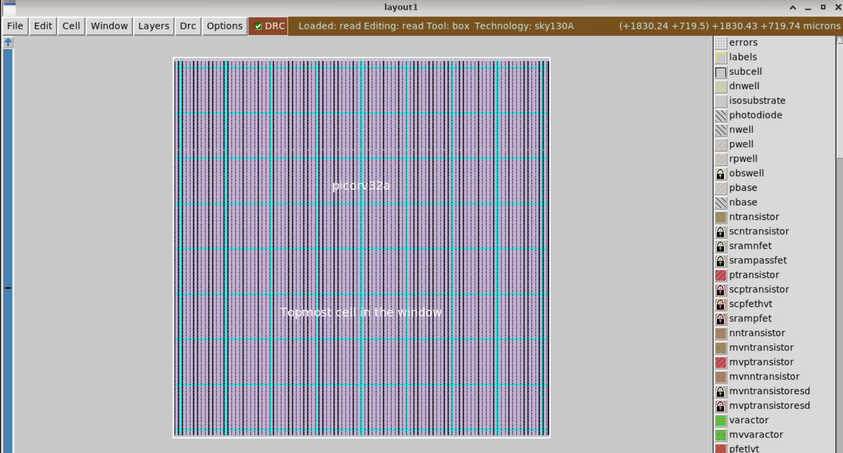

The interface visualizes empty routing corridors, uniform row structures, and the outer layout margins. No logic cell blocks are mapped at this point; instead, pre-placement structures are instantiated across the floorplan:

### Pre-Placement Cell Structures

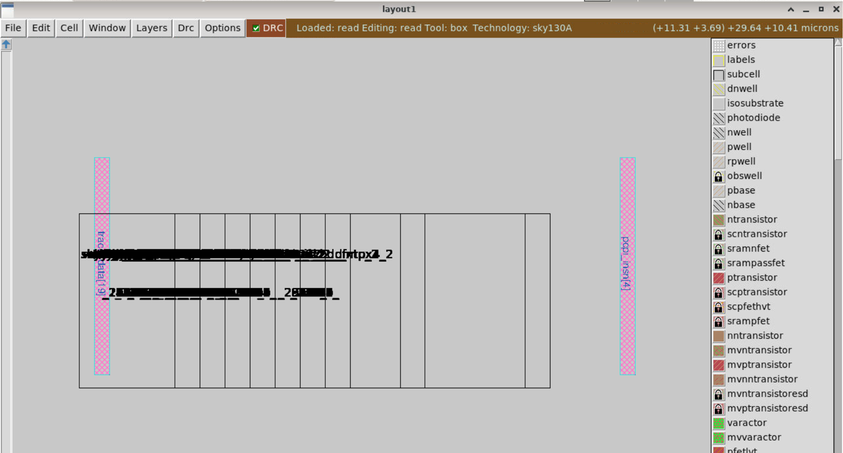

* **Decoupling Capacitors (Decaps):** Positioned at boundary margins to serve as localized charge reservoirs, mitigating transient $IR$ drop and supply voltage switching noise during clock edges.
* **Tap Cells:** Placed periodically across every site row to bias the substrate and $N$-wells, preventing latch-up hazards under high switching frequencies.

### Power Distribution Network (PDN) Engineering

Querying the active layer via the `what` command identifies the physical power grid infrastructure.

```text
Layer: metal3
Signals: VPWR, VGND

```
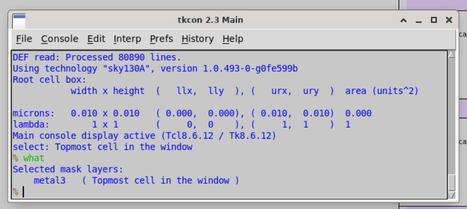
The power infrastructure is synthesized prior to standard cell placement. It forms wide horizontal and vertical power straps designed to deliver balanced electrical voltage throughout the silicon core, preventing power electromigration and maintaining timing reliability.

---

## Experiment: Core Utilization Impact Matrix

To evaluate the direct correlation between utilization constraints and physical manufacturing density, the variable was adjusted from 10% to 30%:

```tcl
set ::env(FP_CORE_UTIL) "30"

```
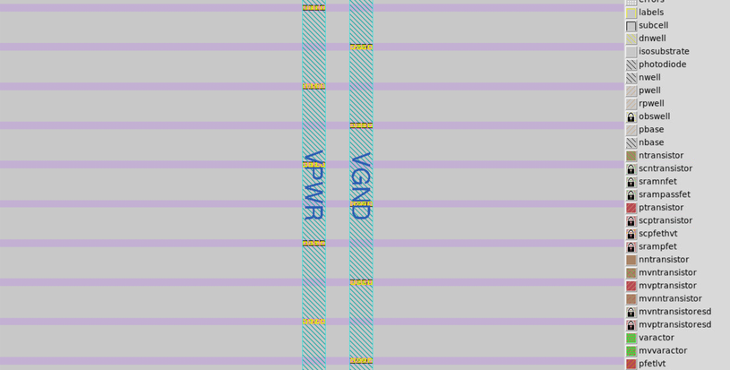
Re-running the floorplan updated the structural blueprint definitions:

```text
DIEAREA ( 0 0 ) ( 743200 753920 ) ;

```
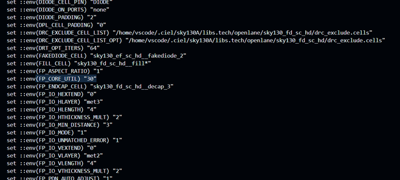
Converting the updated metrics highlights the structural footprint reduction:

| Metric | Low Density Setup (Default) | High Density Setup (Experiment) | Net Footprint Shift |
| --- | --- | --- | --- |
| **Core Utilization** | 10% | 30% | 3x Density Scale Up |
| **Calculated Width** | $1279.175\,\mu\text{m}$ | $743.200\,\mu\text{m}$ | $-535.975\,\mu\text{m}$ |
| **Calculated Height** | $1289.895\,\mu\text{m}$ | $753.920\,\mu\text{m}$ | $-535.975\,\mu\text{m}$ |
| **Total Die Area** | $\approx 1,650,898\,\mu\text{m}^2$ | $\approx 560,915\,\mu\text{m}^2$ | **~66% Silicon Savings** |

>  **Core Mechanical Insight:** Increasing utilization directly squeezes vacant whitespace out of the layout. While it yields compact, cost-efficient silicon dies, it severely restricts downstream routing resources, amplifying wirelength density and routing congestion on Day 5.

---

##  Standard Cell Placement & Multi-Objective Optimization

Following the infrastructure lock, cell placement is executed:

```tcl
run_placement

```
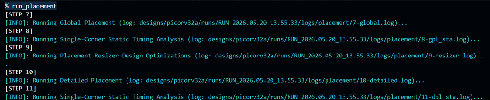
The physical placement engine decomposes the operation into two discrete passes:

### 1. Global Placement

Treats standard cells as fluid elements, spreading thousands of logic gates across the floorplan rows. The optimization loops evaluate wirelength algorithms and localized cell density maps to minimize global routing congestion.

### 2. Detailed Placement

Legalizes the design by mapping cells onto physical rows. This phase locks standard logic cells (buffers, multiplexers, and flip-flops) into continuous rows, removing invalid overlaps and aligning cell rails to the global power buses.

---

##  Post-Placement Verification in Magic

To visually audit the physical cell placement and verify row alignment, the post-placement design file was reloaded into Magic:

```bash
magic -T sky130A.tech \
lef read ../../../tmp/merged.nom.lef \
def read picorv32a.def &

```
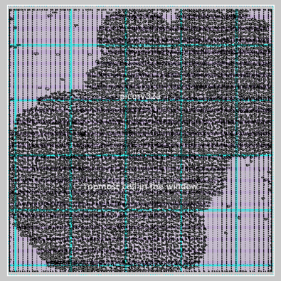

Zooming into the layout row sites confirms that the synthesized cells are fully legalized and locked into place. Cells are positioned based on logic connectivity weight and timing criticality—keeping interconnected flip-flops and combinational logic tightly grouped to minimize parasitic RC wire delay and optimize performance.

---
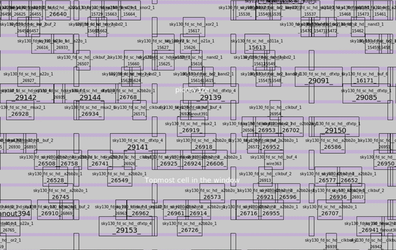

## Key Technical Takeaways

* **RTL Defines Logic, Floorplanning Bounds Space:** Code structures functionality, but the floorplan determines the physical bounding boundaries where those operations are forced to exist.
* **Placement Defines Interconnect Efficiency:** Placement is not an arbitrary arrangement; it acts as a non-linear optimization pipeline that balances structural wire length, timing margins, and routing channel density.
* **Infrastructure Precedes Content:** Electrical power distribution and structural tap/decap safety arrays must dominate the core real estate before standard cell instances can be physically instantiated.

---

## Tooling Matrix

* **Physical Design Engine:** OpenROAD / OpenLane Framework
* **Layout & Physical Auditing:** Magic VLSI Graphics Suite
* **Process Design Kit Node:** Google/SkyWater SKY130A (130nm)
* **Development Workspace:** Linux Platform / GitHub Codespaces
