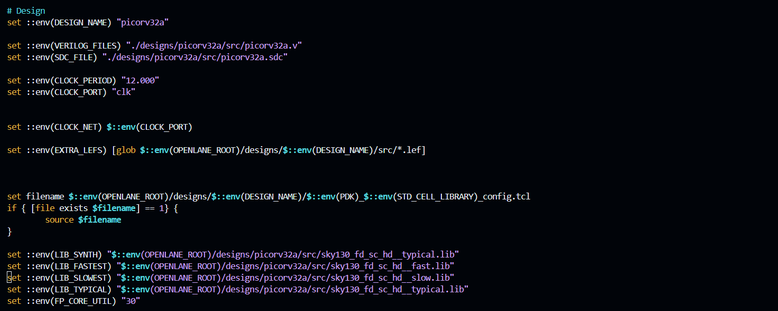
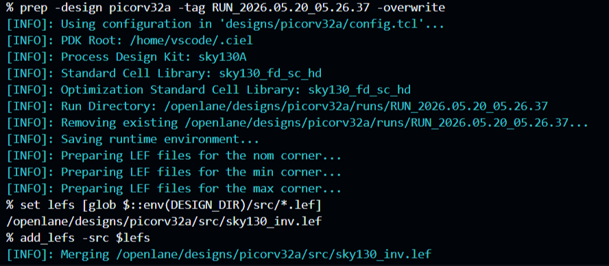
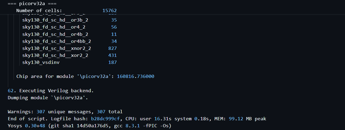
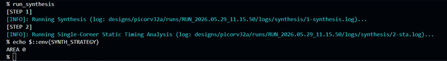
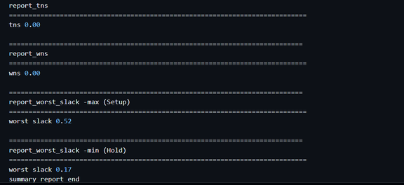
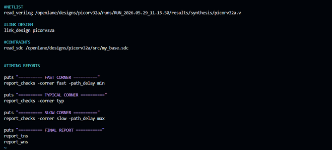
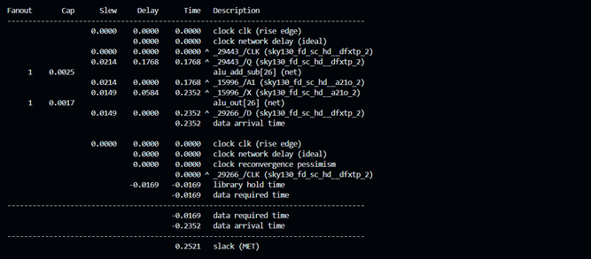
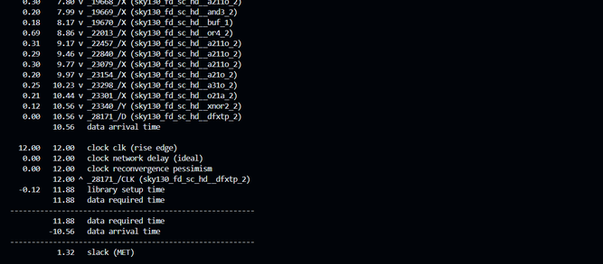
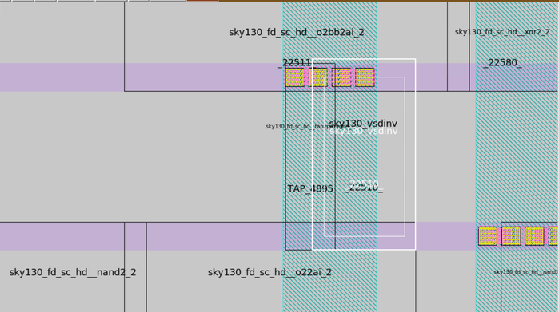

Here is the completely rewritten documentation for your `Day_3.md` file. It features professional VLSI and STA (Static Timing Analysis) terminology, clear comparative tables, structured math expressions, and appropriate relative image path references.

---

# Day 3: Custom Cell Integration & Multi-Corner Static Timing Analysis (STA)

##  Overview

Day 3 focuses on the deep-level integration of a user-defined custom inverter standard cell (`sky130_vsdinv`) into the **PicoRV32A RISC-V** core using **OpenLane**, **Yosys**, and **OpenSTA**. Additionally, this phase explores the differences between default automated tools and standalone Multi-Corner Static Timing Analysis (STA) across distinct process corners, demonstrating how physical variables shift timing slacks.

---

##  Custom Standard Cell Characterization & Environment Mapping

Integrating a new standard cell requires passing both its physical dimensions and its electrical/temporal performance profiles to the EDA tools. The source hierarchy was updated with the following deliverables:

* **Physical Abstraction (`.lef`):** Contains cell dimensions, bounding boxes, pin locations, and metal layers needed for routing.
* **Timing Characterization (`.lib`):** Maps propagation delays, input capacitances, and transition times across `fast`, `typical`, and `slow` PVT (Process, Voltage, Temperature) corners.
* **Design Constraints (`.sdc`):** Defines the clock periods, input/output delays, and uncertainty margins via Synopsys Design Constraints.


*Figure 1: Custom characterization files added to the active project source folder.*

### OpenLane Tool Configuration

To make the technology mapping engine aware of the custom cell, the design parameters within `config.tcl` were updated:

```tcl
set ::env(LIB_SYNTH)   "$::env(DESIGN_DIR)/src/sky130_fd_sc_hd__typical.lib"
set ::env(LIB_FASTEST) "$::env(DESIGN_DIR)/src/sky130_fd_sc_hd__fast.lib"
set ::env(LIB_SLOWEST) "$::env(DESIGN_DIR)/src/sky130_fd_sc_hd__slow.lib"
set ::env(LIB_TYPICAL) "$::env(DESIGN_DIR)/src/sky130_fd_sc_hd__typical.lib"
set ::env(EXTRA_LEFS)   "$::env(DESIGN_DIR)/src/sky130_vsdinv.lef"

```


*Figure 2: Appending custom LEF and Liberty environmental parameters into config.tcl.*

---

##  Synthesis Execution & Structural Cell Auditing

Executing synthesis combines the Library Exchange Format (`.lef`) macros and technology libraries to run technology mapping inside Yosys:

```tcl
prep -design picorv32a -overwrite
run_synthesis

```

*Figure 3: Synthesis log showing the active mapping and instance count of the custom inverter cell.*

Auditing the post-synthesis statistics confirms successful structural integration of the custom block:

```text
Total Mapped Cells   = 15,762 cells
sky130_vsdinv Cells  = 187 instances

```

The technology mapping engine didn't just accept the custom inverter; it actively selected and instantiated it 187 times across the gate-level netlist based on its drive-strength advantages.

---

##  The PPA Trade-Off: Timing-Driven Logic Synthesis

The baseline synthesis run prioritized minimum area layout tracking (`SYNTH_STRATEGY = AREA 0`). To explore the structural impact of timing-driven compilation, the synthesis strategy was switched to prioritize minimal path delays:

```tcl
set ::env(SYNTH_STRATEGY) "DELAY 0"
set ::env(SYNTH_SIZING) "1"

```


*Figure 4: Tracking the default library references used by the automated OpenLane flow.*

Enabling cell sizing (`SYNTH_SIZING`) allows Yosys to automatically replace low-drive gates with stronger variants (e.g., swapping `sky130_fd_sc_hd__inv_2` for `sky130_fd_sc_hd__inv_8`) along critical paths to satisfy tight delay constraints.

### Synthesis Optimization Matrix

| Parameter Metric | Area-Optimized Baseline (`AREA 0`) | Timing-Optimized Iteration (`DELAY 0`) | Structural Net Variance |
| --- | --- | --- | --- |
| **Total Cell Count** | 15,762 cells | 21,256 cells | +5,494 cells (~35% increase) |
| **Estimated Chip Area** | $160,816.736\,\mu\text{m}^2$ | $213,627.386\,\mu\text{m}^2$ | ~33% Silicon Footprint Expansion |
| **Worst Setup Slack (STA)** | 0.52 ns | 4.03 ns | **+3.51 ns Slack Improvement** |



*Figure 5: Crafting the custom multi-corner pre_sta.conf script for standalone timing signoff.*

>  **Core Mechanical Insight:** Shifting to timing-driven synthesis represents a classic PPA trade-off. The engine introduces parallel logic structures and larger, higher drive-strength gates to maximize performance, drastically improving setup slack at the cost of expanding the silicon area.

---

##  Multi-Corner STA Exploration in Standalone OpenSTA

While OpenLane's internal synthesis analysis reported clean timing, it relies on a single-corner simplified environment using `trimmed.lib`. To perform a strict, realistic signed-off timing analysis, a standalone OpenSTA routing manifest (`pre_sta.conf`) was developed to test multi-corner PVT conditions.


*Figure 6: Standalone OpenSTA metrics showing the severe setup timing violations under the slow corner.*

```tcl
# pre_sta.conf script layout snippet
define_corners slow typ fast
read_liberty -corner slow ./src/sky130_fd_sc_hd__slow.lib
read_liberty -corner typ  ./src/sky130_fd_sc_hd__typical.lib
read_liberty -corner fast ./src/sky130_fd_sc_hd__fast.lib
read_verilog ./results/synthesis/picorv32a.v
read_sdc ./src/my_base.sdc
report_checks -path_delay min_max -fields {slew cap input mini}

```

*Figure 7: Updating design parameters to favor DELAY optimization and high-drive cell sizing.*

### PVT Corner Analysis Summary

| Analyzed Timing Corner | Key Analysis Focus | Reported Slack (ns) | Functional Status |
| --- | --- | --- | --- |
| **Fast Corner** (Low Temp / High VDD) | Hold Time Violations | +0.252 ns | **MET** |
| **Typical Corner** (Nominal Conditions) | Standard Path Delay | +1.320 ns | **MET** |
| **Slow Corner** (High Temp / Low VDD) | Setup Time Violations | -10.750 ns | **VIOLATED (Setup Failure)** |



*Figure 8: Evaluation showing the area expansion versus improved setup timing slack.*

>  **Critical Discovery:** A design that appears timing-clean under a default tool snapshot can suffer severe setup violations when stressed across multi-corner signoff environments. A single-corner pass does not guarantee silicon-ready timing closure.

---

##  Advanced Constraint Engineering

To guide the engine toward physical timing closure under realistic operating conditions, stricter constraints were injected into the `.sdc` boundary file to account for clock skew, manufacturing process variations, and realistic input signal behavior:

```tcl
set_clock_uncertainty 1.25 [get_clocks clk]
set_timing_derate -early 0.95
set_timing_derate -late 1.05
set_clock_transition 0.15 [get_clocks clk]
set_input_transition 0.15 [all_inputs]

```

### Post-Constraint Timing Evaluation

| Performance Metric | Before Optimization | After Advanced SDC Constraints | Net Slack Mitigation |
| --- | --- | --- | --- |
| **Worst Negative Slack (WNS)** | -10.75 ns | -2.36 ns | **+8.39 ns Setup Recovery** |
| **Total Negative Slack (TNS)** | -552.47 ns | -31.90 ns | **+520.57 ns Total Slack Restored** |

By incorporating OCV (On-Chip Variation) derating factors and realistic input clock transitions, the timing violations were mitigated substantially, bringing the netlist closer to the target layout specification.

---

##  Physical Layout Placement Verification

Following synthesis optimization and timing validation, the physical implementation was pushed through floorplanning and placement. The post-placement `.def` database was loaded into Magic to verify that the custom cell was successfully placed:

```bash
magic -T sky130A.tech \
lef read ../../../tmp/merged.nom.lef \
def read picorv32a.def &

```


*Figure 9: Finding the physical location of the custom sky130_vsdinv cell inside the Magic layout view.*

Searching the layout database confirms that instances of the `sky130_vsdinv` custom cell are fully instantiated, snapped to the site rows, and seamlessly wired into the power grid alongside the standard cell library blocks.

---

## Key Technical Takeaways

* **Libraries Dictate Timing Realities:** A gate-level netlist contains no fixed timing info on its own. Its performance changes completely depending on the PVT corner libraries used during evaluation.
* **Tuning Constraints Outperforms Blind Compilation:** While switching to a timing-driven synthesis strategy helps, applying precise constraint engineering (like clock uncertainty and timing derates) provides far greater control over timing closure.
* **Logical Integration Requires Physical Verification:** A cell isn't truly integrated until it passes the entire pipeline—progressing from a logical description in Yosys to a physical, routable footprint snapped to the layout grid in Magic.

---

## Tooling Matrix

* **ASIC Implementation Pipeline:** OpenLane v1.0.2 Flow Suite
* **Logic Synthesis Framework:** Yosys Open SYnthesis Suite
* **Static Timing Signoff Engine:** OpenSTA (Standalone Mode)
* **Layout Layout & Cell Mapping:** Magic VLSI Graphics Suite
* **Process Design Kit Node:** Google/SkyWater SKY130A (130nm)
* **Development Workspace:** Linux Platform / GitHub Codespaces
