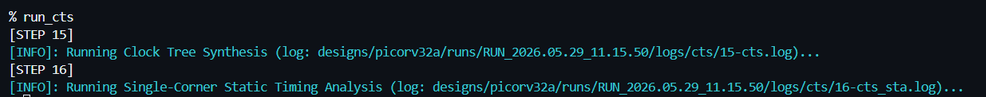
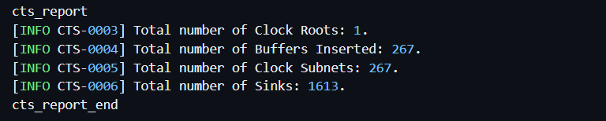
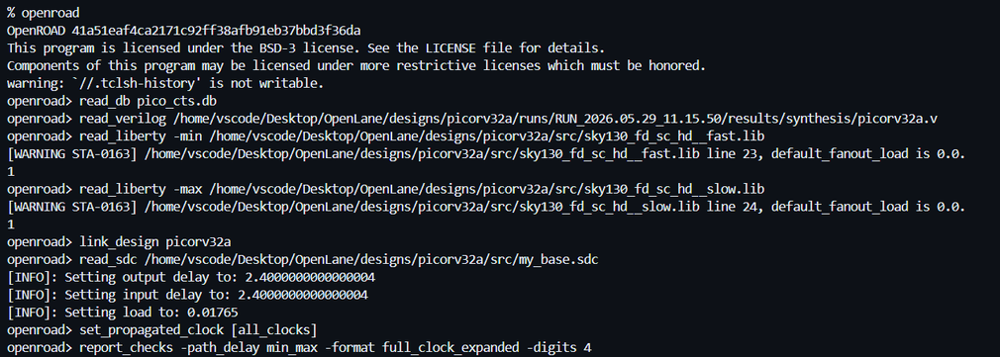
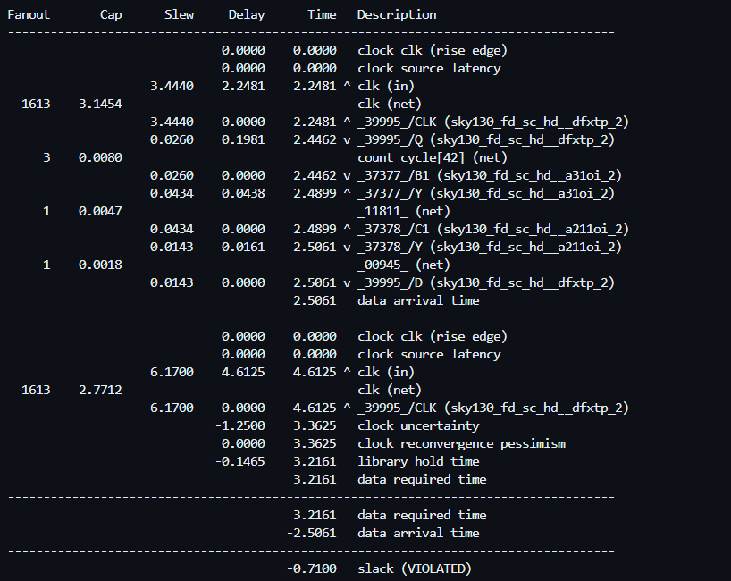
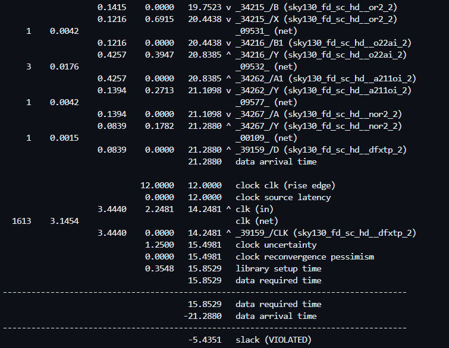
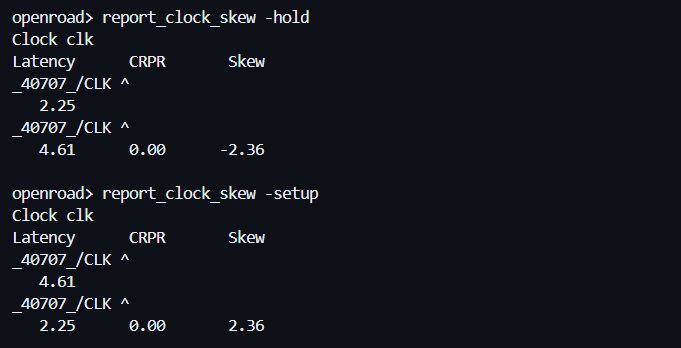
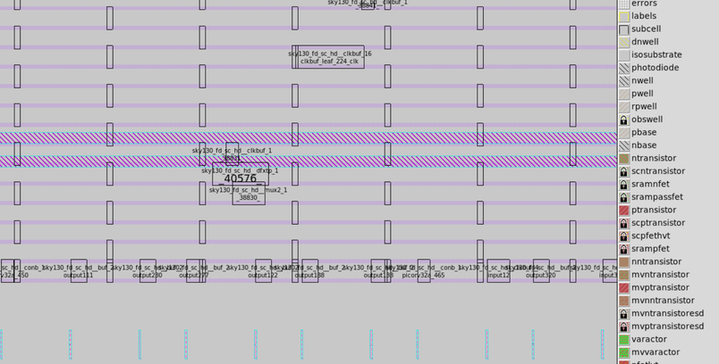

# Day 4: Clock Tree Synthesis (CTS) & Propagated Timing Analysis

##  Overview

Day 4 covers the physical construction and verification of the clock distribution network for the **PicoRV32A RISC-V** core. Moving away from the idealized clock assumptions used in previous stages, this phase utilizes **OpenROAD** and **OpenSTA** to inject a physical clock tree into the layout using the **SKY130A PDK**. The analysis highlights how real clock buffers, wire parasitics, clock skew, and fanout constraints modify the chip's final setup and hold timing margins.

---

##  Clock Tree Synthesis Execution & Core Network Parameters

Prior to this stage, the timing engine treated the clock signal as an "ideal" source capable of driving every flip-flop instantly with zero resistance or wire delay. In physical silicon, attempting to drive thousands of register sinks from a single pin degrades signal transitions and creates extreme skew.

Clock Tree Synthesis is executed to build a balanced distribution network:

```tcl
run_cts

```

Upon successful compilation, the internal OpenROAD engine generates structural reports detailing the mechanical blueprint of the clock tree:

```text
Clock Roots       : 1
Buffers Inserted  : 267
Clock Subnets     : 267
Clock Sinks       : 1,613

```




Instead of routing a single net to all 1,613 sequential flip-flops, the engine builds a hierarchical distribution network. By inserting 267 clock buffers, the total fanout load is divided into distinct subnets, preserving clean signal transition edges (slews) and stabilizing signal integrity.

---

## Physical Floorplan Area Growth Profile

Following the insertion of the physical clock tree, the layout database was audited to measure the resulting overhead on silicon real estate and cell placement density:

| Layout Metric | Pre-CTS Baseline | Post-CTS Implementation | Physical Footprint Shift |
| --- | --- | --- | --- |
| **Total Core Area** | $213,627\,\mu\text{m}^2$ | $246,011\,\mu\text{m}^2$ | +32,384 $\mu\text{m}^2$ (~15% Increase) |
| **Placement Utilization** | ~30% | 35% | +5% Density Growth |




 **Core Mechanical Insight:** Driving timing closure and clock balancing requires additional hardware overhead. The ~15% expansion in silicon area is caused by the physical placement of the 267 high-drive clock buffer cells throughout the core, illustrating the fundamental physical design trade-off where performance optimization impacts area limits.

---

## Post-CTS Timing Environment & Propagated Clock Setup

To evaluate the actual clock network behavior inside **OpenROAD**, the post-CTS database was initialized along with the multi-corner timing libraries:

```tcl
read_db pico_cts.db
read_verilog ./results/synthesis/picorv32a.v
read_liberty -min ./src/sky130_fd_sc_hd__fast.lib
read_liberty -max ./src/sky130_fd_sc_hd__slow.lib
read_sdc ./src/my_base.sdc

```




The critical step in post-CTS verification is disabling ideal clock tracking and instructing the timing engine to calculate the actual delays through the physical clock network:

```tcl
set_propagated_clock [all_clocks]

```

This command transitions the Static Timing Analysis from theoretical approximations to physical accuracy, forcing OpenSTA to trace actual propagation delays through the clock buffer tree, network parasitics, and interconnect paths.

---

## Post-CTS Timing Analysis & Real-World Slack Discovery

### 1. Hold Timing Violation Profile

Trimming ideal clock lines and mapping physical paths reveals a hold timing degradation:

```text
Worst Hold Slack = -0.7100 ns (VIOLATED)

```


Hold violations occur when data propagates too rapidly along the data path relative to the clock arrival edge at the destination flip-flop. The clock arrival differences introduced by real buffer stages exposed hold violations that were masked during ideal-clock analysis. These violations are targeted later in the flow via post-CTS timing repair and manual delay buffer insertion.

### 2. Setup Timing Violation Profile

The maximum delay path report was audited to measure performance along the longest combinational networks:

```text
Worst Setup Slack = -5.4351 ns (VIOLATED)

```




The setup path reports now explicitly account for real-world variables, documenting individual buffer delays, net capacitances, structural transitions (slews), and absolute insertion delays across the sequential logic trees.

---

## Comparative Matrix: Pre-CTS vs. Post-CTS Timing Signoff

To isolate the structural impact of clock network tree synthesis, the timing metrics gathered across both design states were compared:

| Static Timing Metric | Pre-CTS Simulation (Ideal Clock) | Post-CTS Verification (Propagated Clock) | Performance Shift |
| --- | --- | --- | --- |
| **Worst Setup Slack** | -10.7461 ns | -5.4351 ns | **+5.3110 ns Setup Recovery** |
| **Worst Hold Slack** | +0.2521 ns | -0.7100 ns | -0.9621 ns Hold Degradation |
| **Worst Negative Slack (WNS)** | -10.7500 ns | -5.4400 ns | **~50% WNS Improvement** |
| **Total Negative Slack (TNS)** | -552.4700 ns | -318.1500 ns | **+234.32 ns TNS Restored** |



The physical clock distribution network balanced clock arrival times effectively, cutting the Worst Negative Slack roughly in half. However, this optimization introduced hold path violations, highlighting the delicate balancing act required during physical timing closure.

---

## Clock Skew & Global Fanout Constraints Analysis

Evaluating the physical delays across the clock network paths yields the calculated clock skew metrics:

$$\text{Setup Skew} \approx +2.36\text{ ns}$$

$$\text{Hold Skew} \approx -2.36\text{ ns}$$



The equal magnitude and opposite signs of the skew values stem from how setup and hold paths evaluate arrival relationships. While an ideal layout aims for zero skew, real-world implementations always exhibit structural variation. The recorded skew confirms that the timing engine is accurately analyzing the propagated clock network rather than idealized models.

---

## Clock Buffer Distribution & H-Tree Spatial Topology Verification

To verify the physical distribution of the clock tree layout, the post-CTS database was loaded into Magic to audit the cell placement map:

```bash
magic -T sky130A.tech \
lef read ../../../tmp/merged.nom.lef \
def read picorv32a.def &

```



Examining the cell layouts confirms that the `clkbuf` blocks are distributed across the core area. OpenROAD arranges these cells using an algorithmic H-tree topology, balancing the driver loads and structural wire lengths so the clock signal reaches all 1,613 sinks with minimal skew and balanced delay.

---

## Key Technical Takeaways

* **Ideal Clocks Mask Physical Realities:** Pre-CTS timing reports represent an approximation. The clock line only becomes a real physical network containing insertion delays, fanout effects, and parasitic skew post-CTS.
* **CTS Resolves Fanout Bottlenecks:** The primary objective of CTS is dividing extreme fanout loads. Splitting 1,613 register sinks into 267 balanced subnets protects signal integrity and prevents severe slew degradation.
* **Timing Closure is Interdependent:** Optimizing the clock network requires managing trade-offs. Improving global setup margins can introduce localized hold violations, requiring iterative optimization to close both constraints.

---

## Tooling Matrix

* **ASIC Implementation Pipeline:** OpenLane v1.0.2 / OpenROAD Flow Suite
* **Clock Network Synthesis Tool:** OpenROAD Physical Design Engine
* **Static Timing Signoff Engine:** OpenSTA (Propagated Mode)
* **Layout Auditing & Verification:** Magic VLSI Graphics Suite
* **Process Design Kit Node:** Google/SkyWater SKY130A (130nm)
* **Development Workspace:** Linux Platform / GitHub Codespaces

---
