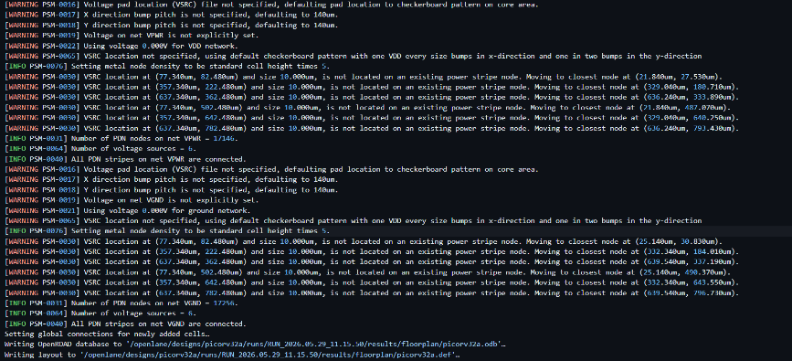
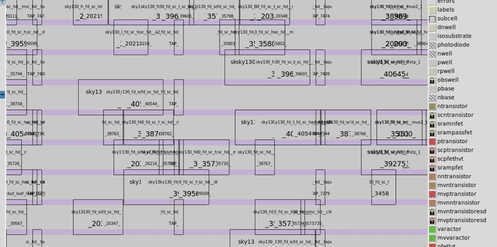
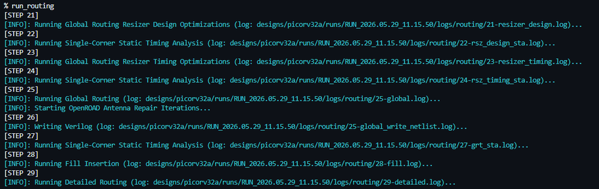
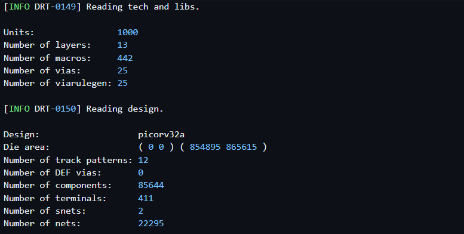
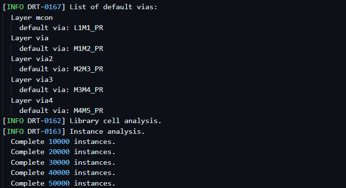
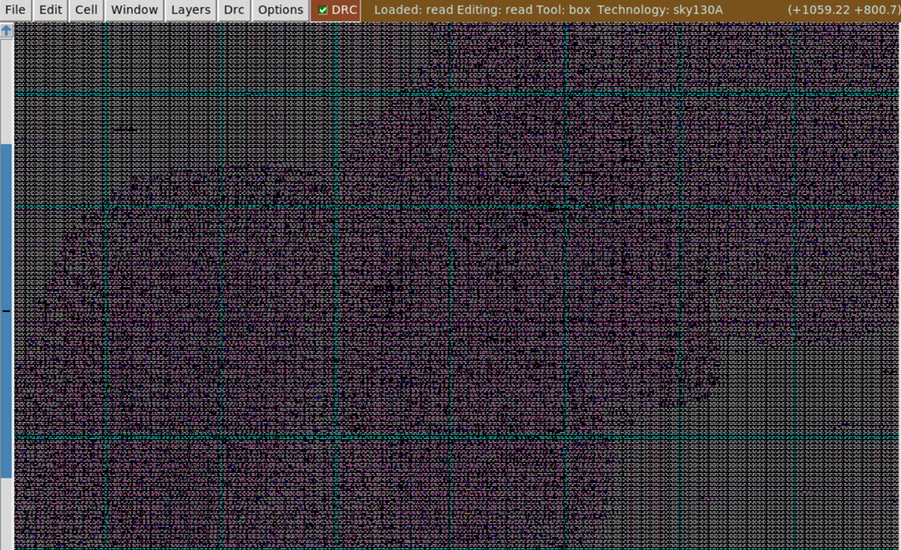
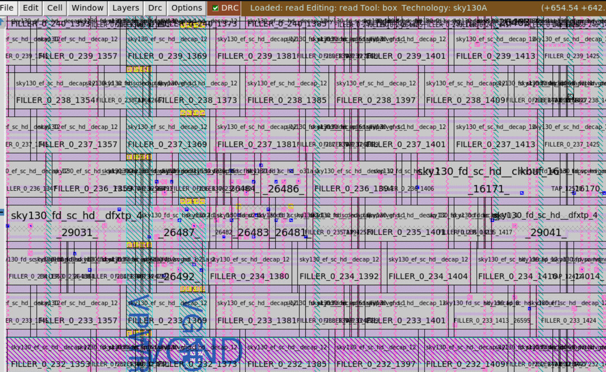

# Day 5: Power Distribution Network, Routing & Signoff Verification

##  Overview

Day 5 represents the final phase of the physical design pipeline for the **PicoRV32A RISC-V** core. Following placement and Clock Tree Synthesis (CTS), this stage constructs a robust **Power Distribution Network (PDN)** to secure supply voltage integrity, implements signal routing via a two-pass global/detailed routing engine, generates post-routing parasitic models (`SPEF`), and executes physical verification checks (**DRC**, **LVS**) required to sign off the design for **GDSII** fabrication tape-out.

---

##  Power Distribution Network (PDN) Synthesis

Before signal nets can be routed, the design requires a solid electrical backbone. The PDN distributes steady $V_{DD}$ and $V_{SS}$ voltages across the chip core, protecting against severe voltage fluctuations ($IR$ drop) and current-induced wear (electromigration).

The power grid is initialized inside OpenROAD:

```tcl
gen_pdn

```


### Structural PDN Report Validation

The generated log file was audited to ensure the electrical continuity and architectural completeness of the power mesh:




### Hierarchical Power Network Architecture

The generated infrastructure forms a multi-tier distribution network:

1. **Power Rings:** Wide metal tracks carrying maximum current around the core perimeter.
2. **Power Straps:** Vertical and horizontal distribution stripes designed to deliver voltage deep into the internal core area.
3. **Standard Cell Rails:** Micro-rails running across the placement rows to feed adjacent standard logic cells directly.

---

##  Standard Cell Row & Power Grid Alignment

The physical layout was verified in Magic to check the structural connection between the macro components and the newly generated power straps:




ASIC cell libraries rely on a standardized template height. This constraint allows the VDD and GND terminals of every logic cell to naturally touch the horizontal metal power rails when placed, completing the supply connection across the core without adding routing congestion.

---

##  Interconnect Routing Architecture & Congestion Profiles

With the power grid locked down, the system prepares the netlists for signal routing. OpenLane generates a pre-route netlist alongside an **Antenna-Diode Netlist**.

>  **The Antenna Effect:** During plasma etching fabrication, long disconnected metal tracks act as accidental capacitors that gather electrical charge. If this charge discharges through a sensitive transistor gate, it can blow the gate oxide and ruin the chip. Inserting antenna diodes provides a safe, alternative path to discharge this energy during manufacturing.

### Core Routing Profile Verification

Prior to full routing execution, the design profile metrics were reviewed to map interconnect complexity:

| Interconnect Parameter | Structural Design Value |
| --- | --- |
| **Total Signal Nets** | Mapped Interconnect Nets |
| **Component Count** | Standard Cells & Macros |
| **Active Routing Layers** | Li1, Met1 through Met5 |
| **Via Interconnects** | Layer-to-Layer Crossings |



---

##  Global Routing vs. Detailed Routing Execution

Signal routing is executed via a two-tier engine to efficiently handle millions of wire pathways:

```tcl
run_routing

```

### 1. Global Routing (FastRoute)

FastRoute models the chip core as a coarse grid, planning approximate paths for each signal net. Instead of drawing actual physical wires, it outputs **Routing Guides** that define which metal layers and routing channels a net should use to prevent early wire congestion.

### 2. Detailed Routing (TritonRoute)

TritonRoute reads these routing guides and builds the physical wires and interlayer vias. It operates using strict layout constraints to ensure complete signal connectivity while cleaning up physical spacing errors.

### TritonRoute Optimization Methodology

The screenshots below capture TritonRoute's detailed routing flow, showing how it honors routing guides, builds connections across layers, and minimizes via counts to maximize production yield.



---

##  Routed Layout Auditing & Parasitic SPEF Extraction

Once routing completed successfully, the physical layout was verified in Magic to inspect the multi-layer wire mesh:




### Zoomed Layout Analysis

Zooming in highlights the interleaved signal paths, filler arrays, and via contacts that bridge different metal layers:




### Post-Routing Parasitic SPEF Extraction

Physical wires introduce real-world parasitics: wire resistance ($R$) and capacitive coupling ($C$). These parasitic effects cause extra signal delay, meaning timing analysis can no longer rely on estimated wire models.

To run accurate, signed-off timing checks, the RC values were pulled from the physical layout into a **Standard Parasitic Exchange Format (SPEF)** file using an external extraction script:

```bash
cd SPEF_EXTRACTOR
python3 main.py <path_to_merged.lef> <path_to_design.def>

```




Using this `.spef` file in post-routing Static Timing Analysis replaces estimated calculations with realistic interconnect delays, providing an accurate look at the chip's final speed.

---

##  Signoff Physical Verification Pipeline

The final milestone before fabrication tape-out is physical verification signoff. This step ensures the geometric layout matches the electrical schematic and satisfies all manufacturing rules.

```text
                  [ Physical Layout (.GDSII/.DEF) ]
                                  │
         ┌────────────────────────┴────────────────────────┐
         ▼                                                 ▼
[ Design Rule Checking (DRC) ]              [ Layout vs. Schematic (LVS) ]
Matches manufacturing tolerances?           Physical gates match RTL netlist?
  • Minimum metal spacing                     • Net/Pin cross-checking
  • Wire width boundaries                     • Transistor count auditing
         │                                                 │
         └────────────────────────┬────────────────────────┘
                                  ▼
                     [ Tape-out Ready Signoff ]

```

The resulting **GDSII** file represents the final manufacturing blueprint sent to the foundry, closing the loop on the PicoRV32A physical design implementation.

---

## Key Technical Takeaways

* **Power Mesh Precedes Signal Routing:** Signal paths cannot be safely routed until the electrical supply backbone is locked down. A solid PDN is critical to prevent $IR$ drop and electromigration failures under active workloads.
* **Routing Strategy Dominates Yield:** Routing is an balancing act. Managing trade-offs through global routing guides and detailed design-rule-aware routing tools directly shapes signal performance and manufacturing yield.
* **Parasitic Characterization is Imperative:** Pre-routing timing analysis is simply a projection. Pulling actual RC parasitics into a `.spef` file is the only way to run a dependable, signed-off Static Timing Analysis.

---

## Tooling Matrix

* **ASIC Implementation Pipeline:** OpenLane v1.0.2 / OpenROAD Flow Suite
* **Routing Automation Tool:** TritonRoute / FastRoute Co-Processors
* **Layout Design & Layout Audit:** Magic VLSI Graphics Suite
* **Parasitic RC Extraction Tool:** Python-based SPEF Extractor Unit
* **Process Design Kit Node:** Google/SkyWater SKY130A (130nm)
* **Development Workspace:** Linux Platform / GitHub Codespaces
