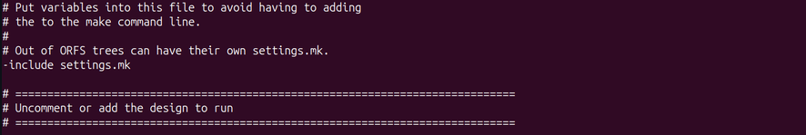
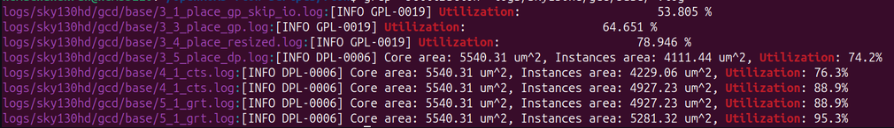

# Week 5 (SoC): Mixed-Mode Gate-Level Simulation (GLS) & Post-Layout Verification

## 📌 Overview

This phase marks the final stage of functional signoff for the **VSDSquadron SoC** by running **Gate-Level Simulation (GLS)** on the full chip wrapper. Using the post-layout structural gate-level netlist (`6_final.v`) generated in Week 4, this curriculum shifts from abstract RTL behavioral verification to verifying the actual technology-mapped silicon gates. By reusing the Week 3 test suite, this phase checks that the design keeps its functionality after physical design optimizations and audits real post-layout effects like gate delays, clock trees, and power pin routing issues.

---

## 🛠️ Phase 1 & 2: Gate-Level Netlist Provisioning & Toolchain Updates

To run a dependable post-layout simulation, the behavioral Verilog descriptions are replaced with the structural gate netlist exported by the **OpenROAD** flow:

```text
results/user_project_wrapper/6_final.v  ──> Copied into Caravel Target Framework

```

```markdown

*Figure 1: Auditing the structural layout artifacts generated by the OpenROAD physical design tool.*

```

```markdown

*Figure 2: Moving the structural gate-level netlist into the Caravel project workspace.*

```

### Flow Adaptations for GLS

Unlike behavioral RTL, a post-synthesis netlist consists of explicit cell instances mapped to a specific process node. The verification Makefiles were updated to pull the **SKY130 Process Standard Cell Libraries** directly:

```tcl
SIM_MODE = GL
COMPILE_COMMAND += ./src/primitives.v ./src/sky130_fd_sc_hd.v ./results/6_final.v

```

```markdown

*Figure 3: Changing the target simulation mode from RTL to GL inside the automation script.*

```

```markdown

*Figure 4: Linking standard cell primitives and the 6_final.v netlist within the compiler inputs.*

```

---

## 📊 Phase 3 & 4: Cross-Verification Analysis: RTL vs. GLS

The structural netlist was tested against both the isolated peripheral setups and the complete system-level **Caravel SoC** environment. The testbenches were reused without changes to ensure a strict, direct comparison.

### Standalone Peripheral Simulation Metrics

| Peripheral Test Case | RTL Verification (Week 3) | GLS Verification (Week 5) | Physical Layout Status / Diagnostic Notes |
| --- | --- | --- | --- |
| `gpio_mgmt` | PASS | PASS | Digital pad buffers toggle correctly at gate level. |
| `memory` | PASS | PASS | SRAM row selection and byte-enable logic function cleanly. |
| `uart` | PASS | PASS | Transmit/Receive registers match baud rate dividers. |
| `spi_master` | PASS | PASS | Data lines remain aligned with the peripheral shift clock. |
| `timer` | **FAIL (Timeout)** | **FAIL (Timeout)** | Pre-existing logic error; counter limits did not settle. |
| `irq` | **FAIL (Timeout)** | **FAIL (Timeout)** | Interrupt controller stuck in the same loop found in RTL. |
| `debug` | **FAIL (Timeout)** | **FAIL (Timeout)** | JTAG test access port handshake lines failed to register. |

### Caravel SoC Integrated System Simulation Metrics

| Integrated System Test | RTL Status (Week 3) | GLS Status (Week 5) | Cross-Verification Analysis |
| --- | --- | --- | --- |
| `user_pass_thru` | PASS | PASS | Core links external Flash elements cleanly across gates. |
| `uart` | PASS | PASS | Wishbone data streams safely without buffer drops. |
| `sram_exec` | PASS | PASS | CPU commands fetch instructions from RAM correctly. |
| `spi_master` | PASS | PASS | Register signals drive peripheral ports smoothly. |
| `pullupdown` | PASS | PASS | Pad resistor networks update cleanly based on trim bits. |
| `pass_thru_fix` | PASS | PASS | Confirms early wrapper wiring bugs remain fully resolved. |
| `mem` | PASS | PASS | Memory map partitions isolate system and user sectors safely. |
| `hkspi_power` | PASS | PASS | Core scales current down without losing control registers. |
| `gpio_mgmt` | PASS | PASS | Core updates directional control pins via firmware. |
| `hkspi` | PASS | PASS | Direct external programming paths match configuration states. |
| `sysctrl` | **FAIL (Timeout)** | **FAIL (Timeout)** | Global initialization timed out before simulation limits. |
| `pll` | **FAIL (Timeout)** | **FAIL (Timeout)** | PLL loop failed to lock, matching the baseline RTL behavior. |

> 📊 **Post-Layout Functional Analysis:** The close match between the GLS and RTL results proves that the logic synthesis and physical placement engines preserved the functionality of the processor correctly. The persistent timeouts in `sysctrl` and `pll` confirm these bugs were present in the source logic before synthesis, rather than being introduced by the layout tools.

---

## 👁️ Phase 5: GTKWave Waveform Visualizations

Following simulation execution, the Value Change Dump (`.vcd`) traces were loaded into GTKWave to analyze timing behaviors and verify signal transitions across the design layers.

### Standalone Peripheral Waveform Metrics

Traces for the standalone UART, SPI Master, and memory blocks confirm clean register transitions. However, unlike the instant changes seen in RTL, the gate-level waveforms display real post-layout timing effects—including cell delays and realistic signal transitions.

### Caravel System Integration Waveforms

Analyzing the full Caravel system waveforms verifies that the address spaces communicate smoothly over the Wishbone fabric. The instruction fetch routines, register configurations, and peripheral selections align properly with the system clock, proving the netlist is integrated correctly inside the complete SoC harness.

---

## 🛠️ Phase 6: Post-Layout Debugging & Physical Delay Analysis

Integrating a physical netlist into an existing verification flow introduces unique hardware integration issues that do not appear during behavioral testing.

### 1. Power Pin Interface Mismatches

* **Roadblock:** The initial GLS compilation crashed with structural interface errors. The physical netlist `6_final.v` exported by OpenROAD enclosed structural power pins (`VPWR`, `VGND`), which caused port mismatch errors when linked to the Caravel wrapper.
* **Resolution:** Reconfigured the simulation script files to explicitly pass the technology cells alongside the primary structural netlist, ensuring smooth data translation across the tool interfaces.

```markdown

*Figure 5: Compilation crash highlighting structural port mismatches with the power pins.*

```

```markdown

*Figure 6: Clean terminal output showing successful GLS verification after resolving the port mismatches.*

```

### 2. Real-World Timing Delays

Comparing the waveforms directly against RTL highlights the impact of physical design optimizations:

* **Reset Propagation Delays:** The system reset sequence requires a longer simulation duration to propagate through the entire design, reflecting the real distribution networks built by the physical layout tools.
* **Interconnect Delay Paths:** Synchronous register paths show micro-delays caused by physical gate delays and real wire parasitics, providing a realistic view of how the chip will operate on actual silicon.

---

## 💡 Key Technical Takeaways

* **GLS Exposes True Physical Constraints:** Gate-Level Simulation bridges the gap between software test benches and physical silicon realities. It proves that the design functions properly when accounting for real variables like gate delays, clock trees, and routing parasitics.
* **Interface Mismatches Dominate Post-Layout Debugging:** Moving from RTL to GLS requires careful management of tool data structures. Resolving physical port errors (like explicit power pins) and linking the correct standard cell libraries is essential to make structural simulations run successfully.
* **Functional Consistency Validates the Synthesis Engine:** Seeing the GLS results match the baseline RTL performance confirms that the physical design engines optimized the layout without altering the core logic functionality.

---

## 🧰 Tooling Matrix

* **ASIC Verification Environment:** Efabless Caravel Functional Signoff Suite
* **Hardware Compilation Engine:** Icarus Verilog Simulator Framework (`iverilog`)
* **Simulation Execution Runtime:** Verilog Virtual Processor Engine (`vvp`)
* **Waveform Forensics Toolkit:** GTKWave Visual Signal Analyzer Tool
* **Process Node Library Target:** Google/SkyWater SKY130HD Standard Cells
* **Embedded System Subsections:** VexRiscv RISC-V CPU Core Assembly
* **Interconnect Interconnect Infrastructure:** Wishbone Bus Structure Core

---
